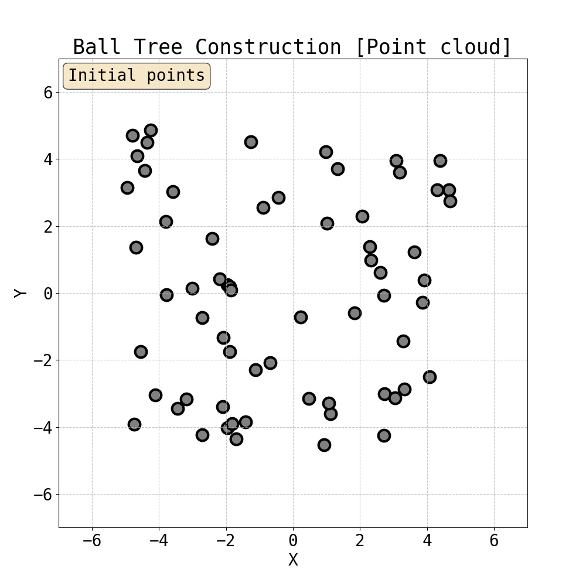
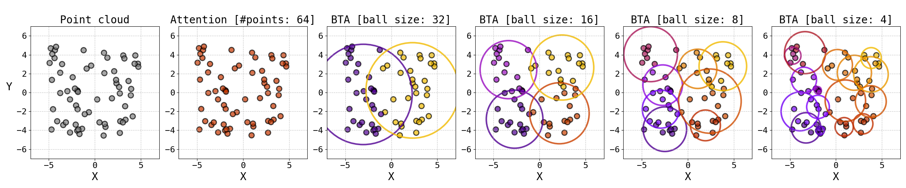

<div align="center">

<p align="center">
  <a href="./paper.pdf">
    
  </a>
</p>


<h3>BSA: Ball Sparse Attention for Large-scale Geometries</h3>

**Authors:** [Catalin E. Brita](https://github.com/C-Brita)\*, [Hieu Nguyen](https://github.com/tr2512)\*, [Lohithsai Yadala Chanchu](https://github.com/Lyadalachanchu)\*  
[Domonkos Nagy](https://github.com/bozo22)\*, [Maksim Zhdanov](https://github.com/maxxxzdn)
</div>

\* Equal contribution.

## Introduction
Scientific applications such as climate modeling, molecular property prediction, or fluid flow simulation increasingly rely on transformer-based architectures to capture complex, long-range dependencies in irregular data. However, self-attention scales quadratically with input size, limiting its use for large-scale physical systems. Although sparse attention mechanisms provide a viable alternative, they are primarily designed for regular structures such as text or images, making them inapplicable for irregular geometries. 

One such example of a sparse attention mechanism is Erwin, which was proposed by our TA, Maksim Zhdanov, organizes points into a ball tree where the leaf level represents the full sequence, and balls in higher levels of the tree represent larger neighborhoods. Erwin enables linear time attention by processing nodes in parallel within local neighborhoods of fixed size. It combines fine-grained local attention with progressive pooling for capturing global interactions. This approach performs well at local interactions but may require several steps for distant ones, as accumulating global information requires multiple layers. The progressive coarsening of such hierarchical methods also results in a loss of fidelity, as coarsened features cannot be processed at finer scales.

We developed Ball Sparse Attention (BSA), which adapts NSA to unordered point sets by imposing regularity using the ball-tree structure from the Erwin Transformer. We modify each of NSA’s components to work with ball-based neighborhoods, yielding a global receptive field at sub-quadratic cost. Concretely, we use ball attention (full attention inside the balls generated by Erwin) instead of the sliding window attention for the local stage. This mitigates the fidelity loss issue of Erwin, as well as the multiple steps required for attending to distant tokens (due to selection and compression stages NSA respectively). We also noticed that attention is done in groups in the selection stage, even if this was not explicitly enforced. Concretely, we saw that finer query points in a block all seemed to mostly attend to similar key blocks. This motivated us to build on top of NSA to also coarsen the queries (NSA only coarsened the keys and the values during the compression stage), which led to significant speedups.


## Background

### Ball Tree
A **ball tree** is a hierarchical data structure that recursively partitions points into nested sets of similar size, where each set is represented by a ball that covers all the points in the set. The input is a point cloud, and the tree is built recursively:
<p align="center">
    
</p>

### Ball Tree Attention (BTA) \[[1](https://arxiv.org/abs/2502.17019)\]
To improve computational efficiency, attention can be computed within the ball tree partitions. Once the tree is built, one can choose the level of the tree and compute attention (**Ball Tree Attention**, BTA) within the balls in parallel:
<p align="center">
    
</p>

### Native Sparse Attention (NSA) \[[2](https://arxiv.org/abs/2502.11089)\]

Overview of NSA’s architecture. Left: The framework processes input sequences through three parallel attention branches: For a given query, preceding keys and values are processed into compressed attention for coarse-grained patterns, selected attention for important token blocks, and sliding attention for local context. Right: Visualization of different attention patterns produced by each branch. Green areas indicate regions where attention scores need to be computed, while white areas represent regions that can be skipped.

<p align="center">
  
</p>


## Using BSA (Ball Sparse Attention)
BSA expects as inputs:
 - `node_features`: a ragged array of node features, shape: [num_points, num_features]
 - `node_positions`: a ragged array of node positions, shape: [num_points, num_dimensions]
 - `batch_idx`: batch assignment for each node, shape: [num_points] (e.g. [0, 0, 1, 1, 1, 2, 2, ...])

```python
import torch
from models import FlatTransformer, TransformerConfig

cfg = TransformerConfig(
    c_in                     = 64,
    c_hidden                 = 64,
    depth                    = 18,
    num_heads                = 8,
    block_size               = 6,
    mlp_ratio                = 4,
    dimensionality           = 3,
    ball_size                = 256,
    should_rotate            = True,
    rotation_angle           = 45,
    attention_type           = "sparse",
    attention_kwargs = dict(
        compress_block_size         = 8,
        selected_blocks_number      = 4,
        use_compress_mlp           = True,
        compress_mlp_expand_factor = 2.0,
        use_group_selection        = True,
        group_selection_size       = 8,
        should_mask_blocks_in_ball = True,
        use_token_gated_attention  = True,
        use_coarse_q_attn          = True,
        use_coarse_q_importance    = True,
    ),
)

model = FlatTransformer(**config).cuda()

bs = 16
num_points = 2048

node_features = torch.randn(num_points * bs, 64).cuda()
node_positions = torch.rand(num_points * bs, 3).cuda()
batch_idx = torch.repeat_interleave(torch.arange(bs), num_points).cuda()

out = model(node_features, node_positions, batch_idx)
```

### BSA scales sub-quadratically  

BSA replaces the dense \(N^2\) interaction of global attention with local ball attention plus block-level compression & selection. In practice it overtakes global attention at ≈4 k tokens and is ~5 × faster at 64 k tokens.  

<p align="center">
  
</p>

We also compared the four BSA variants (no group-select, no query-coarsen, +group-compress, vanilla), showing that every variant stays sub-quadratic, with group compression giving the best speedup.

<p align="center">
  
</p>
 
### BSA has a global receptive field

Local ball attention covers nearby points, while the selection branch pulls in the top-\(k\) distant balls and the compression branch makes a summary of **every** block globally available. The gated fusion of these three branches lets each query reach any part of the sequence in a single layer, resulting in a true global receptive field.

<p align="center">
  
</p>

### BSA has a minimal set of dependencies
BSA has a minimal number of dependencies:
- PyTorch (version 2.5.0, CUDA 12.4)
- NumPy
- einops
- Cython
- torch-cluster (optional, is used to build a graph in the Embedding module)

A virtual environment named `bsa` can be created using `uv`
and activated with:
```
bash setup.sh
```

If you only want to play with BSA and don't want to install additional dependencies (tensorflow, spconv, etc.) use
```
bash setup.sh --minimal
```

to install `uv` run:
```
curl -LsSf https://astral.sh/uv/install.sh | sh
```


## Replicating experiments  

### Experimental Data
To run/replicate experiments, you will need to download:
- [ShapeNet-Car dataset](https://github.com/ml-jku/UPT/blob/main/SETUP_DATA.md) (2 GB) 
- [Elasticity Dataset](https://drive.google.com/drive/folders/1cznHmQO-hB_VlWOfh7IFpjsPVOYyghGJ) (360 MB)

### Experiments
Training scripts are given in [experiments](experiments). 

#### 1. Airflow Pressure Prediction (ShapeNet-Car)

This task predicts airflow pressure on the ShapeNet-Car dataset using a flat transformer model with sparse attention:
```
cd experiments
python train_shapenet.py --use-wandb 1 --size small --model flat_transformer --attention_type "sparse" --data-path "path/to/data/dir"
```

#### 2. Stress Field Prediction (Elasticity Benchmark)

This task predicts stress fields on the Elasticity Benchmark dataset using a flat transformer model with sparse attention.


```
cd experiments
python train_elas.py --use-wandb 1 --size small --model flat_transformer --attention_type "sparse" --data-path "path/to/data/dir"
```
## Results

**Table 1: Shapenet test MSE**

| Model          | MSE   |
|----------------|-------|
| PointNet       | 43.36 |
| GINO           | 35.24 |
| UPT            | 31.66 |
| Transolver     | 19.88 |
| PTv3           | 19.09 |
| GP-UPT         | 17.02 |
| Erwin          | 15.85 |
| BSA (Ours)     | 14.47 |
| Full attention | 13.29 |

---

**Table 2: Elasticity test rMSE**

| Model        | rMSE    |
|--------------|---------|
| LSM          | 0.0218  |
| LNO          | 0.0069  |
| Galerkin     | 0.0240  |
| Orformer     | 0.0183  |
| Gnot         | 0.0086  |
| Ono          | 0.0118  |
| Transolver   | 0.0064  |
| Erwin        | 0.0035  |
| BSA (Ours)   | 0.0039  |

## Future work
We will test our grouping mechanism on more datasets and develop a GPU kernel to
exploit group BSA operations for improved computational efficiency and reduced memory footprint.
